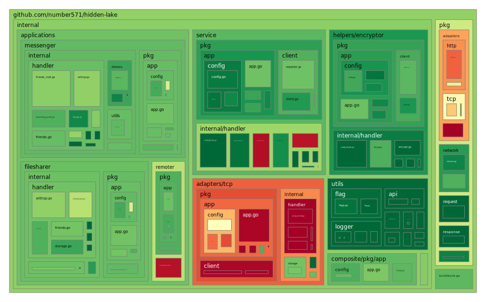

<h2>
	<p align="center">
    	<strong>
        	Theoretically Provable Anonymous Network
   		</strong>
	</p>
	<p align="center">
        <a href="https://github.com/topics/golang">
        	
		</a>
        <a href="https://github.com/number571/go-peer/releases">
        	
		</a>
        <a href="https://github.com/number571/go-peer/blob/master/LICENSE">
        	
		</a>
        <a href="https://github.com/number571/hidden-lake/actions">
        	
		</a>
		<a href="https://github.com/number571/go-peer/blob/d06ff1b7d35ceb8fa779acda2e1335896b0afdb1/cmd/Makefile#L50">
        	
		</a>
        <a href="https://pkg.go.dev/github.com/number571/hidden-lake/cmd/hidden-lake?status.svg">
        	
		</a>
        <a href="https://github.com/number571/go-peer">
        	
		</a>
	</p>
    <p align="center">
        <a href="https://goreportcard.com/report/github.com/number571/hidden-lake">
        	
		</a>
        <a href="https://github.com/number571/hidden-lake/pulse">
        	
		</a>
		<a href="https://github.com/number571/hidden-lake/commits/master">
        	
		</a>
        <a href="https://github.com/number571/hidden-lake/blob/b27339aa283eb137e680a9ca6a04391e7960510a/Makefile#L107">
        	
		</a>
        <a href="https://img.shields.io/github/languages/code-size/number571/hidden-lake.svg">
        	
		</a>
        <a href="https://img.shields.io/github/downloads/number571/hidden-lake/total.svg">
        	
		</a>
    </p>
    <p align="center">
        <a href="https://github.com/croqaz/awesome-decentralized">
        	
		</a>
        <a href="https://github.com/redecentralize/alternative-internet">
        	
		</a>
        <a href="https://github.com/number571/awesome-anonymity">
        	
		</a>
    </p>
	About project
</h2>

> [!IMPORTANT]
> The project is being actively developed, the implementation of some details may change over time. More information about the changes can be obtained from the [CHANGELOG.md](https://github.com/number571/hidden-lake/blob/master/CHANGELOG.md) file.

The `Hidden Lake` is an anonymous network built on a `micro-service` architecture. At the heart of HL is the core - `HLS` (service), which generates anonymizing traffic and combines many other services (for example, `HLT` and `HLM`). Thus, Hidden Lake is not a whole and monolithic solution, but a composition of several combined services. The HL is a `friend-to-friend` (F2F) network, which means building trusted communications. Due to this approach, members of the HL network can avoid `spam` in their direction, as well as `possible attacks` if vulnerabilities are found in the code.

## Coverage map

<p align="center"></p>

## Releases

All cmd programs are compiled for {`amd64`, `arm64`} ARCH and {`windows`, `linux`, `darwin`} OS as pattern = `appname_arch_os`. In total, one application is compiled into six versions. The entire list of releases can be found here: [github.com/number571/hidden-lake/releases](https://github.com/number571/hidden-lake/releases "releases"). 

## List of applications

Basic | Applied | Helpers
:-----------------------------:|:-----------------------------:|:------------------------------:
[HL Service](cmd/hls) | [HL Messenger](cmd/hlm) | [HL Traffic](cmd/hlt)
[HL Composite](cmd/hlc) | [HL Filesharer](cmd/hlf) | [HL Loader](cmd/hll)
[HL Adapters](cmd/hla) | [HL Remoter](cmd/hlr) | [HL Encryptor](cmd/hle)

## How it works

The Hidden Lake anonymous network is based on the (queue-based) `QB-problem`, which can be described by the following list of actions:

1. Each message `m` is encrypted with the recipient's key `k`: `c = Ek(m)`,
2. Message `c` is sent during period `= T` to all network participants,
3. The period `T` of one participant is independent of the periods `T1, T2, ..., Tn` of other participants,
4. If there is no message for the period `T`, then a false message `v` is sent to the network without a recipient (with a random key `r`): `c = Er(v)`,   
5. Each participant tries to decrypt the message they received from the network: `m = Dk(c)`.

<p align="center"></p>
<p align="center">Figure 1. QB-network with three nodes {A,B,C}</p>

> More information about Hidden Lake in research paper: [hidden_lake_anonymous_network.pdf](docs/hidden_lake_anonymous_network.pdf)

## Build and run

Launching an anonymous network is primarily the launch of an anonymizing HLS service. There are two ways to run HLS: through `source code`, and through the `release version`. It is recommended to run applications with the available release version, [tag](https://github.com/number571/hidden-lake/tags).

### 1. Running from source code

```bash
$ go install github.com/number571/hidden-lake/cmd/hls@latest
$ hls
```

### 2. Running from release version

```bash
$ wget https://github.com/number571/hidden-lake/releases/latest/download/hls_amd64_linux
$ chmod +x hls_amd64_linux
$ ./hls_amd64_linux
```

## Production

### Running

The HLS node is easy to connect to a production environment. To do this, it is sufficient to specify two parameters: `network_key` and `connections`. The network_key parameter is used to separate networks from each other, preventing them from merging. The connections parameter is used for direct network connection to HLS and HLT nodes.

```bash
$ wget https://github.com/number571/hidden-lake/blob/master/configs/8Jkl93Mdk93md1bz/hls.yml
# where 8Jkl93Mdk93md1bz is a network key
$ hls
```

<p align="center"></p>
<p align="center">Figure 2. Example of request to echo-service</p>

> There are also examples of running HL applications in a production environment. For more information, follow the links: [echo_service](https://github.com/number571/hidden-lake/tree/master/examples/anonymity/echo_service/prod_test), [anon_messenger](https://github.com/number571/hidden-lake/tree/master/examples/anonymity/messenger/prod_test), [anon_filesharer](https://github.com/number571/hidden-lake/tree/master/examples/anonymity/filesharer/prod_test).

### Settings

The Hidden Lake network must have `common configuration` file settings for successful data exchange between network nodes. If some settings are different, other nodes will consider it a `protocol violation` and reject the connection attempt. You can find ready-made configuration files for HLS services in the [configs](https://github.com/number571/hidden-lake/tree/master/configs) directory.

```yaml
# default settings
message_size_bytes: 8192
work_size_bits: 22
fetch_timeout_ms: 60000
queue_period_ms: 5000
```

<table style="width: 100%">
  <tr>
    <th>Available network</th>
    <th>Types of services</th>
  </tr>
  <tr>
    <td>
        <table style="width: 100%">
            <tr>
                <th>ID</th>
                <th>Type</th>
                <th>Version</th>
                <th>Host</th>
                <th>Port</th>
                <th>Network key</th>
                <th>Provider</th>
                <th>Country</th>
                <th>City</th>
                <th>Characteristics</th>
                <th>Expired time</th>
                <th>Logging</th>
                <th>DB-hash</th>
                <th>STG-size</th>
            </tr>
            <tr>
                <td>1</td>
                <td>HLTr/HLTs</td>
                <td>v1.7.0</td>
                <td>94.103.91.81</td> 
                <td>9581/9582</td>
                <td>8Jkl93Mdk93md1bz</td>
                <td><a href="https://vdsina.ru">vdsina.ru</a></td>
                <td>Russia</td>
                <td>Moscow</td>
                <td>1x4.0GHz, 1.0GB RAM, 30GB HDD</td>
                <td>±eternal</td>
                <td>off</td>
                <td>on</td>
                <td>30_000</td>
            </tr>
            <tr>
                <td>2</td>
                <td>HLTr/HLTs</td>
                <td>v1.7.0</td>
                <td>195.133.1.126</td>
                <td>9581/9582</td>
                <td>kf92j74Nof92n9F4</td>
                <td><a href="https://ruvds.com">ruvds.ru</a></td>
                <td>Russia</td>
                <td>Moscow</td>
                <td>1x2.2GHz, 0.5GB RAM, 10GB HDD</td>
                <td>±28.07.2027</td>
                <td>off</td>
                <td>off</td>
                <td>10_000</td>
            </tr>
            <tr>
                <td>3</td>
                <td>HLTr/HLTs</td>
                <td>v1.7.0</td>
                <td>193.233.18.245</td>
                <td>9581/9582</td>
                <td>oi4r9NW9Le7fKF9d</td>
                <td><a href="https://4vps.su">4vps.su</a></td>
                <td>Russia</td>
                <td>Novosibirsk</td>
                <td>1x2.5GHz, 1.0GB RAM, 5GB VNMe</td>
                <td>±07.08.2027</td>
                <td>on</td>
                <td>off</td>
                <td>10_000</td>
            </tr>
            <tr>
                <td>4</td>
                <td>HLTr/HLTs</td>
                <td>v1.7.0</td>
                <td>185.43.4.253</td>
                <td>9581/9582</td>
                <td>j2BR39JfDf7Bajx3</td>
                <td><a href="https://firstvds.ru">firstvds.ru</a></td>
                <td>Russia</td>
                <td>Moscow</td>
                <td>1x3.1GHz, 2.0GB RAM, 300GB HDD</td>
                <td>±10.12.2024</td>
                <td>off</td>
                <td>on</td>
                <td>30_000</td>
            </tr>
        </table>
    </td>
    <td>
        <table style="width: 100%">
            <tr>
                <th>Type</th>
                <th>Name</th>
                <th>Default port</th>
            </tr>
            <tr>
                <td>HLS</td>
                <td>node</td>
                <td>9571</td>
            </tr>
            <tr>
                <td>HLTr</td>
                <td>relayer</td>
                <td>9581</td>
            </tr>
            <tr>
                <td>HLTs</td>
                <td>storage</td>
                <td>9582</td>
            </tr>
        </table>
    </td>
  </tr>
</table>

## Star History

[](https://star-history.com/#number571/hidden-lake&Date)

## License

Licensed under the MIT License. See [LICENSE](LICENSE) for the full license text.

**[⬆ back to top](#releases)**
