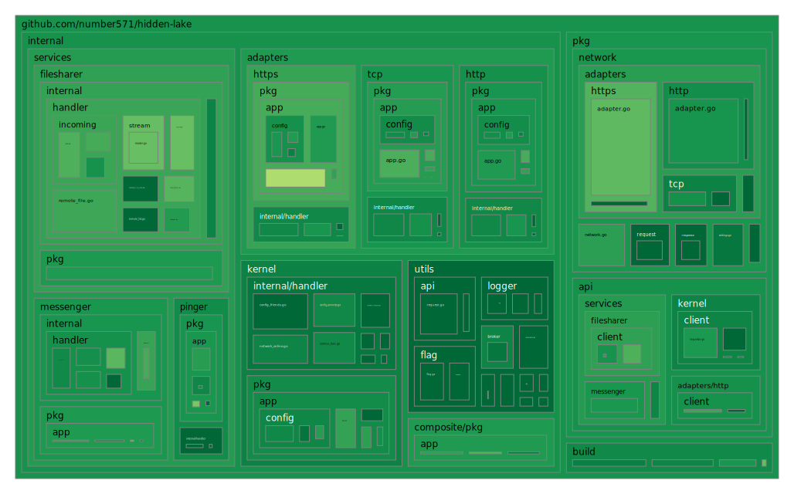
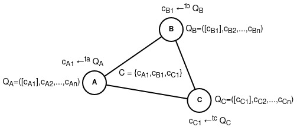

<h2>
	<p align="center">
    	<strong>
        	Theoretically Provable Anonymous Network
   		</strong>
	</p>
	<p align="center">
        <a href="https://github.com/topics/golang">
        	
		</a>
        <a href="https://github.com/number571/hidden-lake/releases">
        	
		</a>
        <a href="https://github.com/number571/hidden-lake/blob/master/LICENSE">
        	
		</a>
        <a href="https://github.com/number571/hidden-lake/actions">
        	
		</a>
		<a href="https://github.com/number571/hidden-lake/blob/629bbca6e6bed8961175e8722efb62e575343971/Makefile#L76">
        	
		</a>
        <a href="https://pkg.go.dev/github.com/number571/hidden-lake?status.svg">
        	
		</a>
        <a href="https://github.com/number571/go-peer">
        	
		</a>
	</p>
    <p align="center">
        <a href="https://goreportcard.com/report/github.com/number571/hidden-lake">
        	
		</a>
        <a href="https://github.com/number571/hidden-lake/pulse">
        	
		</a>
		<a href="https://github.com/number571/hidden-lake/commits/master">
        	
		</a>
        <a href="https://github.com/number571/hidden-lake/blob/b27339aa283eb137e680a9ca6a04391e7960510a/Makefile#L107">
        	
		</a>
        <a href="https://img.shields.io/github/languages/code-size/number571/hidden-lake.svg">
        	
		</a>
        <a href="https://img.shields.io/github/downloads/number571/hidden-lake/total.svg">
        	
		</a>
    </p>
    <p align="center">
        <a href="https://github.com/croqaz/awesome-decentralized">
        	
		</a>
        <a href="https://github.com/redecentralize/alternative-internet">
        	
		</a>
		<a href="https://vk.me/join/6Px6b0Qh/uZIK4ixUYWQm4Krepzq5xbYjYw=">
        	
		</a>
		<a href="https://t.me/+9Kcxr8NyeU8zZDZi">
        	
		</a>
    </p>
	About project
</h2>

> [!IMPORTANT]
> The project is being actively developed, the implementation of some details may change over time. More information about the changes can be obtained from the [CHANGELOG.md](CHANGELOG.md) file.

The `Hidden Lake` is an anonymous network built on a `micro-service` architecture. At the heart of HL is the core - `HLK` (service), which generates anonymizing (queue based) traffic and combines many other services (`HLS=filesharer`, `HLS=messenger`, `HLS=remoter` and etc). Thus, Hidden Lake is not a whole and monolithic solution, but a composition of several combined services. The HL is a `friend-to-friend` (F2F) network, which means building trusted communications. Due to this approach, members of the HL network can avoid `spam` in their direction, as well as `possible attacks` if vulnerabilities are found in the code.

## Coverage map

<p align="center"></p>

## Releases

All cmd programs are compiled for {`amd64`, `arm64`} ARCH and {`windows`, `linux`, `darwin`} OS as pattern = `appname_arch_os`. In total, one application is compiled into six versions. The entire list of releases can be found here: [github.com/number571/hidden-lake/releases](https://github.com/number571/hidden-lake/releases "releases"). 

## Dependencies

1. Go library [github.com/number571/go-peer](https://github.com/number571/go-peer "go-peer") (used by `cmd/hlk`)

### Makefile

There are a number of dependencies that represent separate applications for providing additional information about the quality of the code. These applications are not entered into the project, but are loaded via the `make install-deps` command. The list of applications is as follows:

1. golangci-lint [github.com/golangci/golangci-lint@v2.1.2](https://github.com/golangci/golangci-lint/tree/v2.1.2)
2. go-cover-treemap [github.com/nikolaydubina/go-cover-treemap@v1.4.2](https://github.com/nikolaydubina/go-cover-treemap/tree/v1.4.2)

## How it works

The Hidden Lake assigns the task of anonymity to the `QB-problem` (queue based).

<table>
<tr>
  <th>Actions within the QB-problem</th>
  <th>Figure QB-network with three nodes</th>
</tr>
<tr>
<td>
	<ol>
	  <li>Each message <b>m</b> is encrypted with the recipient's key <b>k</b>: <b>c = Ek(m)</b></li>
	  <li>Message <b>c</b> is sent during period <b>= T</b> to all network participants</li>
	  <li>The period <b>T</b> of one participant is independent of the periods <b>T1, T2, ..., Tn</b> of other participants</li>
	  <li>If there is no message for the period <b>T</b>, then a false message <b>v</b> is sent to the network without a recipient (with a random key <b>r</b>): <b>c = Er(v)</b></li>
	  <li>Each participant tries to decrypt the message they received from the network: <b>m = Dk(c)</li>
	</ol>
</td>
<td>
	<p align="left">----------------------------------------------------------------</p>
	
	<p align="right">----------------------------------------------------------------</p>
</td>
</tr>
</table>

> More information about Hidden Lake and QB-problem in research paper: [hidden_lake_anonymous_network.pdf](docs/hidden_lake_anonymous_network.pdf)

## List of applications

1. Basic:
   * [HLK](cmd/hlk) - anonymizes traffic using the QB-problem
   * [HLC](cmd/hlc) - runs many HL applications as one application
2. Adapters:
   * [HLA=tcp](cmd/hla/hla-tcp) - adapts HL traffic over TCP protocol
   * [HLA=http](cmd/hla/hla-http) - adapts HL traffic over HTTP ptotocol
3. Services:
   * [HLS=messenger](cmd/hls/hls-messenger) - send and recv text messages
   * [HLS=filesharer](cmd/hls/hls-filesharer) - view storage and download files 
   * [HLS=remoter](cmd/hls/hls-remoter) - executes remote access commands
   * [HLS=pinger](cmd/hls/hls-pinger) - ping the node to check online status

## Build and run

> [!IMPORTANT]
> As an additional level of security, it is recommended to run the Hidden Lake anonymous network in a virtual machine. This will make it possible to secure the main execution environment if vulnerabilities are found in HL, and it will also hide the operation/interaction of HL services from the main execution environment.

Launching an anonymous network is primarily the launch of an anonymizing `HLK` and `HLA=tcp` services. Simultaneous launch of these services can be performed using the `HLC` application. You can edit the list of running services using the `hlc.yml` file. There are two ways to run HLC: through `source code`, and through the `release version`. 

### 1. Running from source code

```bash
$ go install github.com/number571/hidden-lake/cmd/hlc@latest
$ hlc
```

### 2. Running from release version

```bash
$ wget https://github.com/number571/hidden-lake/releases/latest/download/hlc_amd64_linux
$ chmod +x hlc_amd64_linux
$ ./hlc_amd64_linux
```

## Production

The HLK node is easily connected to the production environment throw HLA=tcp. To do this, you just need to specify the `network` at startup. You can find them in the [networks.yml](build/networks.yml) file. 

```bash
$ hlc --network oi4r9NW9Le7fKF9d
```

You can also create your own networks by copying the contents of the networks.yml file to the execution directory with the renamed name `hl-networks.yml`. Further, the contents of this file can be overwritten or supplemented.

<p align="center"></p>

## Communication

To communicate with other network nodes, you must first obtain your public key, which was generated for the first time when launching HLK. To do this, you need to access the [HLK API](cmd/hlk/README.md#hlk-api) at the `internal` address provided in `hlk.yml` (by default `localhost:9572`).

```bash
$ curl -X GET 'http://localhost:9572/api/profile/pubkey'
```

After receiving the public key, it must be transferred to the future interlocutor, as well as receive his own public key from him. Thus, an `F2F handshake` will occur, where each party will explicitly establish the public key of the interlocutor. To install the key of the interlocutor, you can also use the `HLK API` or just edit `hlk.yml` file with restart HLK application.

```bash
$ curl -X POST 'http://localhost:9572/api/config/friends' --data '{"alias_name":"friend", "public_key":"PubKey{...}"}'
```

__Success__. Now you can start communicating! You can write own applied services over `HLK/HLS API` or just use simple `CLI` applications, as example [hlk-cli](cmd/hlk/client/hlk-cli/), [hls-messenger-cli](cmd/hls/hls-messenger/client/hls-messenger-cli/), [hls-filesharer-cli](cmd/hls/hls-filesharer/client/hls-filesharer-cli/), [hls-remoter-cli](cmd/hls/hls-remoter/client/hls-remoter-cli/), [hls-pinger-cli](cmd/hls/hls-pinger/client/hls-pinger-cli/). 

## Star History

[](https://star-history.com/#number571/hidden-lake&Date)

## License

Licensed under the MIT License. See [LICENSE](LICENSE) for the full license text.

**[⬆ back to top](#releases)**
