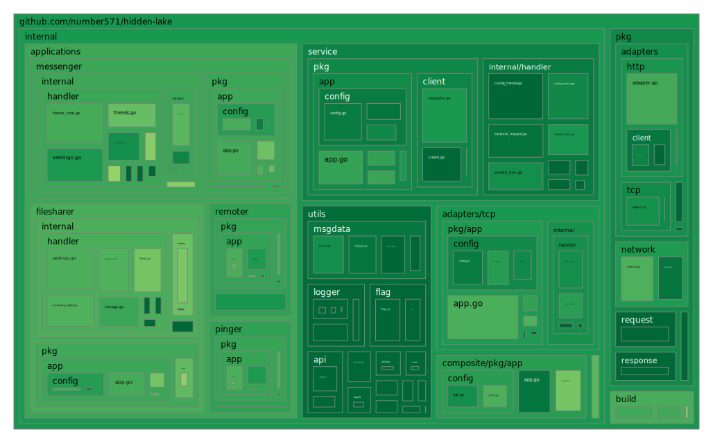

<h2>
	<p align="center">
    	<strong>
        	Theoretically Provable Anonymous Network
   		</strong>
	</p>
	<p align="center">
        <a href="https://github.com/topics/golang">
        	
		</a>
        <a href="https://github.com/number571/hidden-lake/releases">
        	
		</a>
        <a href="https://github.com/number571/hidden-lake/blob/master/LICENSE">
        	
		</a>
        <a href="https://github.com/number571/hidden-lake/actions">
        	
		</a>
		<a href="https://github.com/number571/hidden-lake/blob/629bbca6e6bed8961175e8722efb62e575343971/Makefile#L76">
        	
		</a>
        <a href="https://pkg.go.dev/github.com/number571/hidden-lake?status.svg">
        	
		</a>
        <a href="https://github.com/number571/go-peer">
        	
		</a>
	</p>
    <p align="center">
        <a href="https://goreportcard.com/report/github.com/number571/hidden-lake">
        	
		</a>
        <a href="https://github.com/number571/hidden-lake/pulse">
        	
		</a>
		<a href="https://github.com/number571/hidden-lake/commits/master">
        	
		</a>
        <a href="https://github.com/number571/hidden-lake/blob/b27339aa283eb137e680a9ca6a04391e7960510a/Makefile#L107">
        	
		</a>
        <a href="https://img.shields.io/github/languages/code-size/number571/hidden-lake.svg">
        	
		</a>
        <a href="https://img.shields.io/github/downloads/number571/hidden-lake/total.svg">
        	
		</a>
    </p>
    <p align="center">
        <a href="https://github.com/croqaz/awesome-decentralized">
        	
		</a>
        <a href="https://github.com/redecentralize/alternative-internet">
        	
		</a>
        <a href="https://github.com/number571/awesome-anonymity">
        	
		</a>
		<a href="https://vk.me/join/6Px6b0Qh/uZIK4ixUYWQm4Krepzq5xbYjYw=">
        	
		</a>
		<a href="https://t.me/+9Kcxr8NyeU8zZDZi">
        	
		</a>
    </p>
	About project
</h2>

> [!IMPORTANT]
> The project is being actively developed, the implementation of some details may change over time. More information about the changes can be obtained from the [CHANGELOG.md](CHANGELOG.md) file.

The `Hidden Lake` is an anonymous network built on a `micro-service` architecture. At the heart of HL is the core - `HLS` (service), which generates anonymizing traffic and combines many other services (for example, `HLF` and `HLM`). Thus, Hidden Lake is not a whole and monolithic solution, but a composition of several combined services. The HL is a `friend-to-friend` (F2F) network, which means building trusted communications. Due to this approach, members of the HL network can avoid `spam` in their direction, as well as `possible attacks` if vulnerabilities are found in the code.

## Coverage map

<p align="center"></p>

## Releases

All cmd programs are compiled for {`amd64`, `arm64`} ARCH and {`windows`, `linux`, `darwin`} OS as pattern = `appname_arch_os`. In total, one application is compiled into six versions. The entire list of releases can be found here: [github.com/number571/hidden-lake/releases](https://github.com/number571/hidden-lake/releases "releases"). 

## Dependencies

1. Go library [github.com/number571/go-peer](https://github.com/number571/go-peer "go-peer") (used by `cmd/hls`)
2. Go library [golang.org/x/net](https://golang.org/x/net "x/net") (used by `cmd/hlm`)
3. CSS/JS library [getbootstrap.com](https://getbootstrap.com "bootstrap") (used by `cmd/hlm,cmd/hlf`)

### Makefile

There are a number of dependencies that represent separate applications for providing additional information about the quality of the code. These applications are not entered into the project, but are loaded via the `make install-deps` command. The list of applications is as follows:

1. golangci-lint [github.com/golangci/golangci-lint/cmd/golangci-lintv1.60.0](https://github.com/golangci/golangci-lint/tree/v1.60.0)
2. go-cover-treemap [github.com/nikolaydubina/go-cover-treemap@v1.4.2](https://github.com/nikolaydubina/go-cover-treemap/tree/v1.4.2)

## How it works

The Hidden Lake assigns the task of anonymity to the `QB-problem` (queue based).

<table>
<tr>
  <th>Actions within the QB-problem</th>
  <th>Figure QB-network with three nodes</th>
</tr>
<tr>
<td>
	<ol>
	  <li>Each message <b>m</b> is encrypted with the recipient's key <b>k</b>: <b>c = Ek(m)</b></li>
	  <li>Message <b>c</b> is sent during period <b>= T</b> to all network participants</li>
	  <li>The period <b>T</b> of one participant is independent of the periods <b>T1, T2, ..., Tn</b> of other participants</li>
	  <li>If there is no message for the period <b>T</b>, then a false message <b>v</b> is sent to the network without a recipient (with a random key <b>r</b>): <b>c = Er(v)</b></li>
	  <li>Each participant tries to decrypt the message they received from the network: <b>m = Dk(c)</li>
	</ol>
</td>
<td>
	<p align="left">----------------------------------------------------------------</p>
	
	<p align="right">----------------------------------------------------------------</p>
</td>
</tr>
</table>

> More information about Hidden Lake and QB-problem in research paper: [hidden_lake_anonymous_network.pdf](docs/hidden_lake_anonymous_network.pdf)

## List of applications

1. Basic:
   * [HLS](cmd/hls) - anonymizes traffic using the QB-problem
   * [HLC](cmd/hlc) - runs many HL services as one application
   * [HLA](cmd/hla) - adapts HL traffic to external environments
2. Applied:
   * [HLM](cmd/hlm) - messenger with a web interface
   * [HLF](cmd/hlf) - file sharing with a web interface
   * [HLR](cmd/hlr) - executes remote access commands

## Build and run

Launching an anonymous network is primarily the launch of an anonymizing HLS and HLA=tcp services. There are two ways to run HLS & HLA=tcp: through `source code`, and through the `release version`. 

### 1. Running from source code

```bash
$ go install github.com/number571/hidden-lake/cmd/hlc@latest
$ hlc
```

### 2. Running from release version

```bash
$ wget https://github.com/number571/hidden-lake/releases/latest/download/hlc_amd64_linux
$ chmod +x hlc_amd64_linux
$ ./hlc_amd64_linux
```

## Production

The HLS node is easily connected to the production environment throw HLA=tcp. To do this, you just need to specify the `network` at startup. You can find them in the [networks.yml](build/networks.yml) file.

```bash
$ hlc --network oi4r9NW9Le7fKF9d
```

<p align="center"></p>

After such a launch, the hls.yml, hla_tcp.yml files will be created or overwritten (if it existed). The `settings` (hls.yml, hla_tcp.yml) and `connections` (hla_tcp.yml) fields will be substituted in it. When overwriting a file, only the above fields will be changed. The remaining fields of the `friends`, `services`, `address`, etc. type will not be overwritten.

> Examples of running HL apps in a prod environment: [echo_service](examples/echo_service/prod_test), [anon_messenger](examples/messenger/prod_test), [anon_filesharer](examples/filesharer/prod_test).

## Star History

[](https://star-history.com/#number571/hidden-lake&Date)

## License

Licensed under the MIT License. See [LICENSE](LICENSE) for the full license text.

**[⬆ back to top](#releases)**
