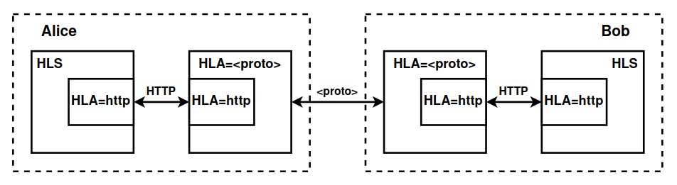

# HLA

> Hidden Lake Adapters


`Hidden Lake Adapters` allow you to adapt anonymizing traffic to various communication protocols and platforms.

## List of adapters

1. [HLA=tcp](hla-tcp) - adapts HL traffic to a custom TCP connection
2. [HLA=http](hla-http) - adapts HL traffic to a custom HTTP connection

## Installation

It is necessary to replace `<proto>` with an existing adapter in the list.

```bash
$ go install github.com/number571/hidden-lake/cmd/hla/hla_<proto>@latest
```

## How it works

HLA are based on two functions: `Consume` and `Produce`. Due to this, at the interface level, users do not care about the nature of communication: where ciphertexts are read from and where they are written. Due to this property, as well as the properties of QB networks to preserve anonymity in any communication environment, it becomes possible to write adapters not only for network protocols, but also for centralized services, thereby creating secret communication channels.

<p align="center"></p>
<p align="center">Figure 1. Architecture of HLA</p>

## Supported platforms

- Windows (x86_64, arm64)
- Linux (x86_64, arm64)
- MacOS (x86_64, arm64)

## Build and run

Default build and run

```bash 
$ go run ./cmd/hla/hla_<proto>

> [INFO] 2024/12/29 03:40:06 HLA=<proto> is started
> ...
```

Creates [`./hla_<proto>.yml`](./hla-tcp/hla-tcp.yml) file (as example `tcp`).

## Running options

```bash
$ hla_<proto> --path /root --network xxx
# path    = path to config, database, key files
# network = use network configuration from networks.yml
```
