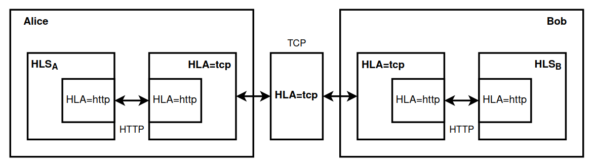

# HLA=tcp

> Hidden Lake Adapter (TCP)

The `HLA=tcp` allows [HLS](https://github.com/number571/hidden-lake/tree/master/cmd/hls) nodes to communicate with each other via the TCP protocol. The advantage of this method over the standard `HLA=http` adapter located directly in HLS is that nodes do not need to open an external IP address to successfully accept traffic. HLA=tcp adapter uses [network.INode](https://github.com/number571/go-peer/blob/b47da386fce1be6b5410a6bfdfca3a35654bcdac/pkg/network/types.go#L21) and [connkeeper.IConnKeeper](https://github.com/number571/go-peer/blob/b47da386fce1be6b5410a6bfdfca3a35654bcdac/pkg/network/connkeeper/types.go#L10) interfaces.

Figure 1. Architecture of HLA=tcp

## About adapters

Adapters are based on two functions: Consume and Produce. Due to this, at the interface level, users do not care about the nature of communication: where ciphertexts are read from and where they are written. Due to this property, as well as the properties of QB networks to preserve anonymity in any communication environment, it becomes possible to write adapters not only for network protocols, but also for centralized services, thereby creating secret communication channels.
