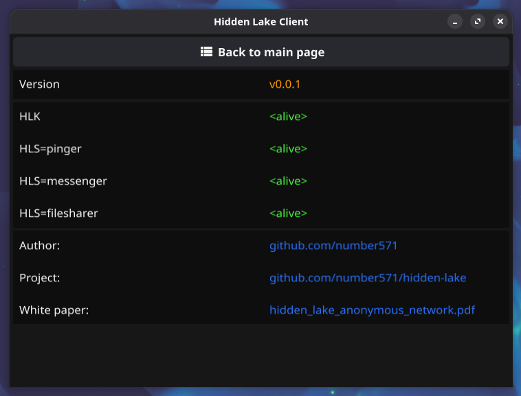
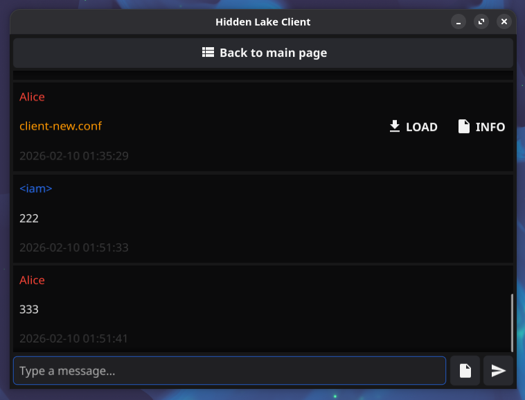
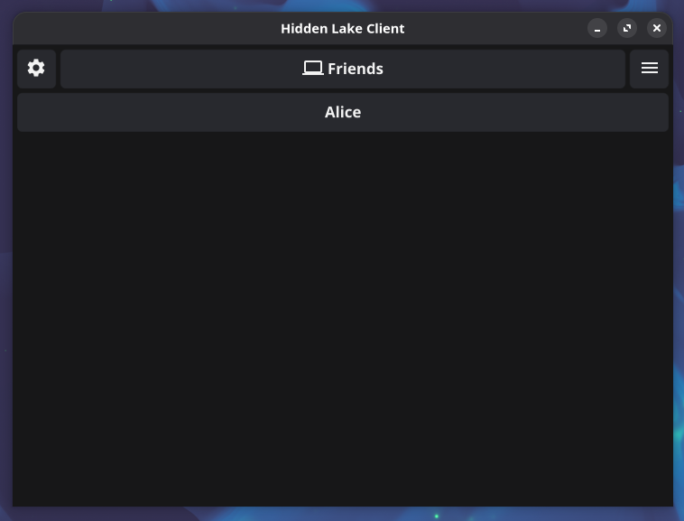
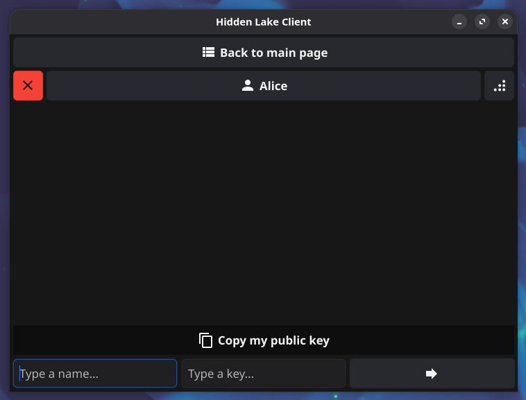
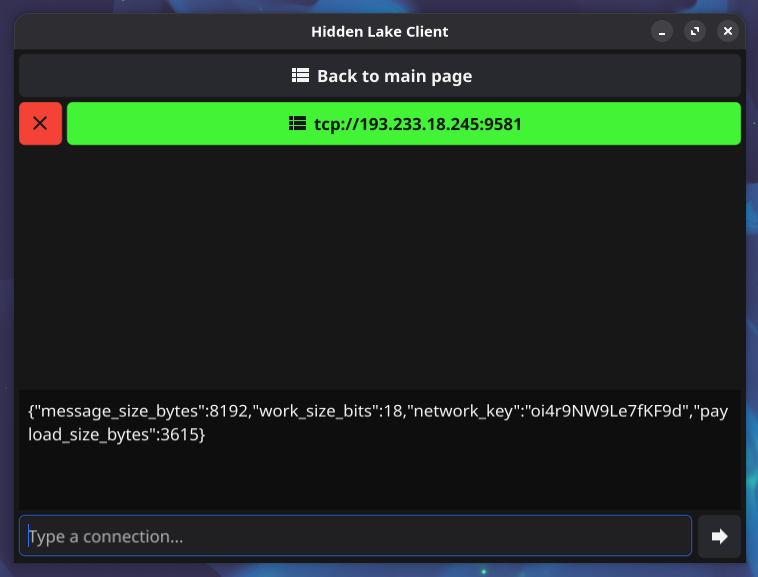

# hidden-lake-client

> Client for anonymous network «Hidden Lake» written in Go &amp; Fyne

## Installation

```bash
$ go install github.com/number571/hidden-lake-client@latest
```

## How it works

The `Hidden Lake Client` connects to four Hidden Lake services: HLK (kernel), HLS=pinger, HLS=messenger, HLS=filesharer. 

To send a text message, used `HLS API` of HLS=messenger. To send a file, used the combination HLS=messenger + HLS=filesharer - the file is first uploaded to the local storage, then a link to this file is sent to the interlocutor using HLS=messenger, the interlocutor in turn downloads the file from the remote storage of a friend. `HLK API` is used to edit connections and friend list.

## Supported platforms

- Windows (x86_64, arm64)
- Linux (x86_64, arm64)

## Running options

```bash 
$ hidden-lake-client -k {{HLK-address}} -p {{HLS=pinger-address}} -m {{HLS=messenger-address}} -f {{HLS=filesharer-address}}
# [-k, --kernel]     = address of the HLK internal address (default localhost:9572)
# [-p, --pinger]     = address of the HLS=pinger internal address (default localhost:9551)
# [-m, --messenger]  = address of the HLS=messenger internal address (default localhost:9591)
# [-f, --filesharer] = address of the HLS=filesharer internal address (default localhost:9541)
```

> [!WARNING]
> Please do not connect to Hidden Lake services outside of the `localhost` environment if you are not sure about the security of your network. Connecting via a local network is not secure if the router is connected to a service provider. Moreover, it is not safe to connect to services from the global network (connect uses pure HTTP protocol)!

## Screenshots

<table>
<tr>
  <th><b>About</b></th>
  <th><b>Chat</b></th>
  <th><b>Chat list</b></th>
  <th><b>Friends</b></th>
  <th><b>Connections</b></th>
 </tr>
 <tr>

  <td>

   
  
  </td>
   
  <td>

   
  
  </td>

  <td>

   
  
  </td>
  
  <td>

   
  
  </td>

  <td>

   
  
  </td>
  
 </tr> 
</table>
